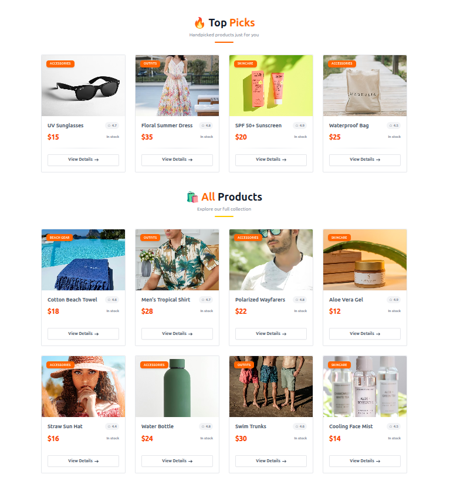
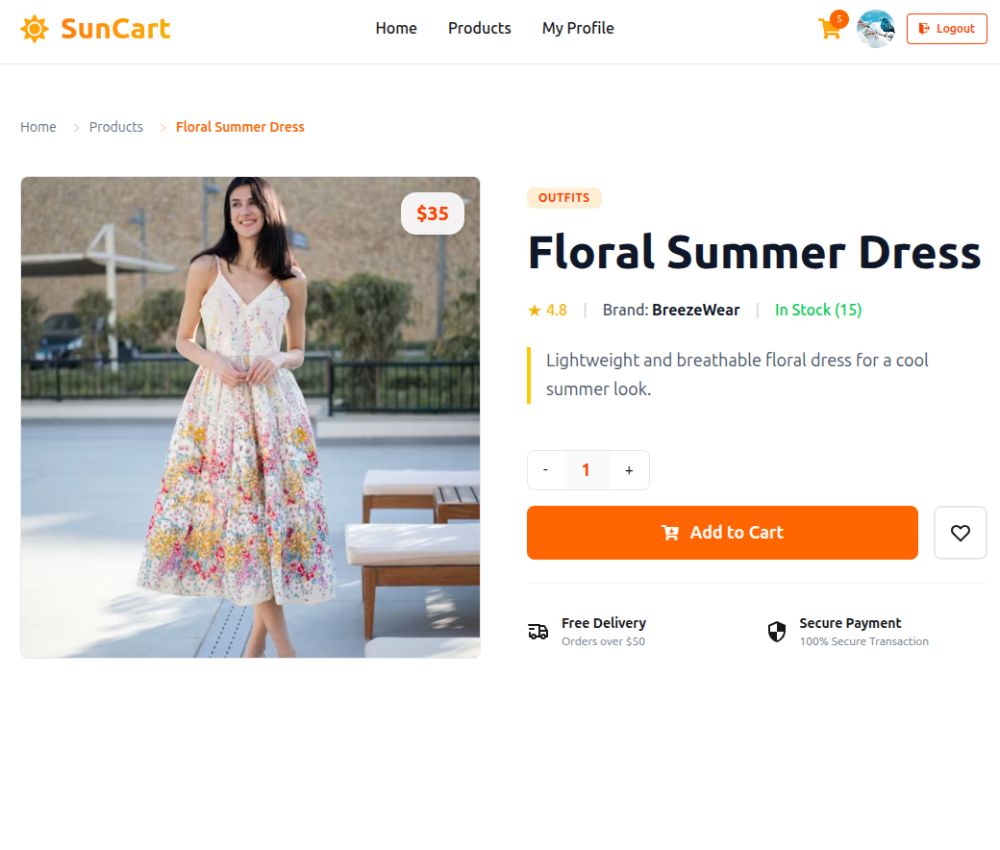
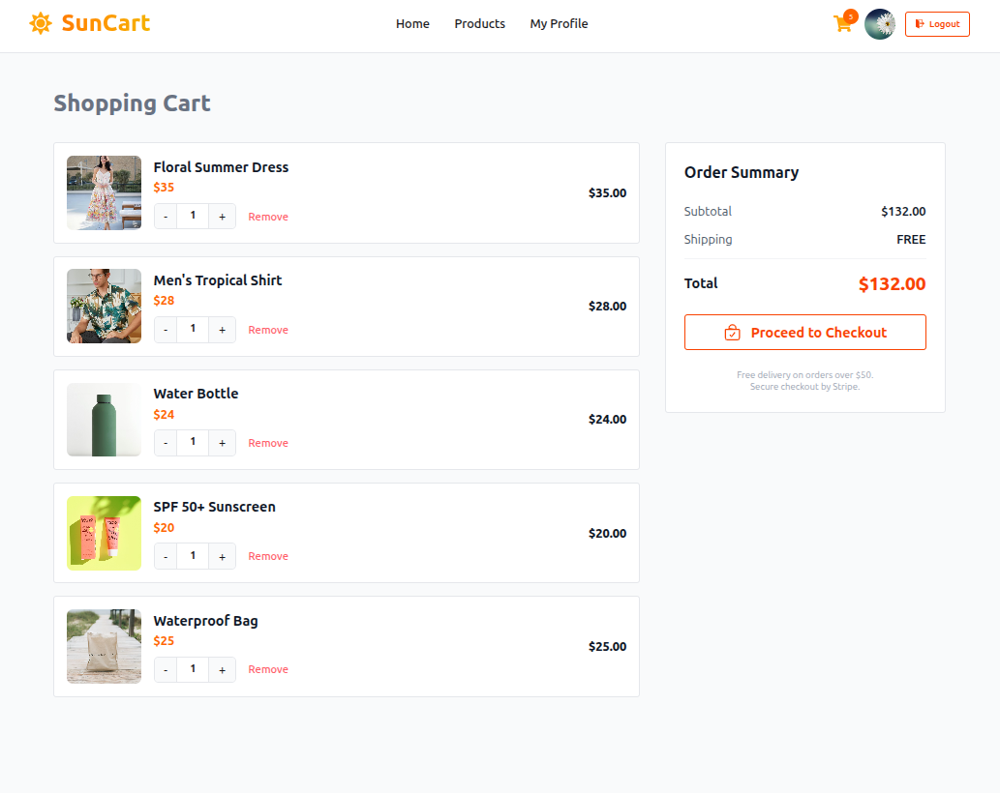
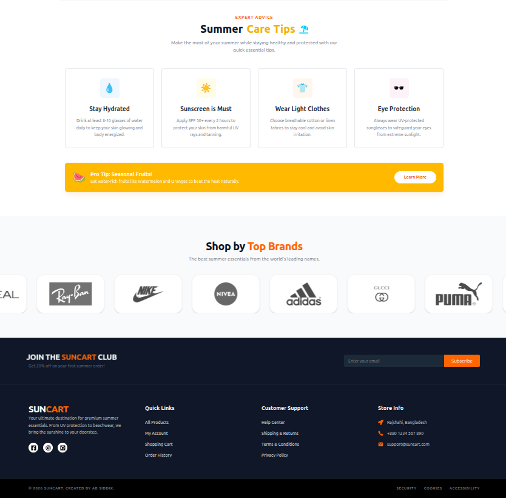
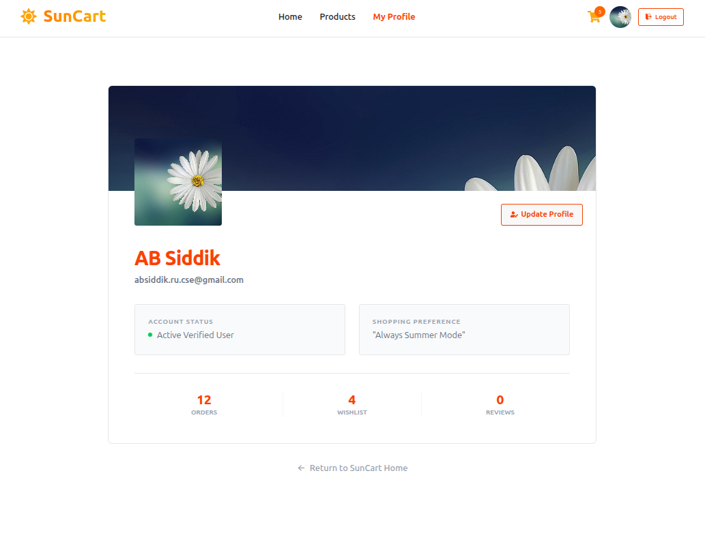
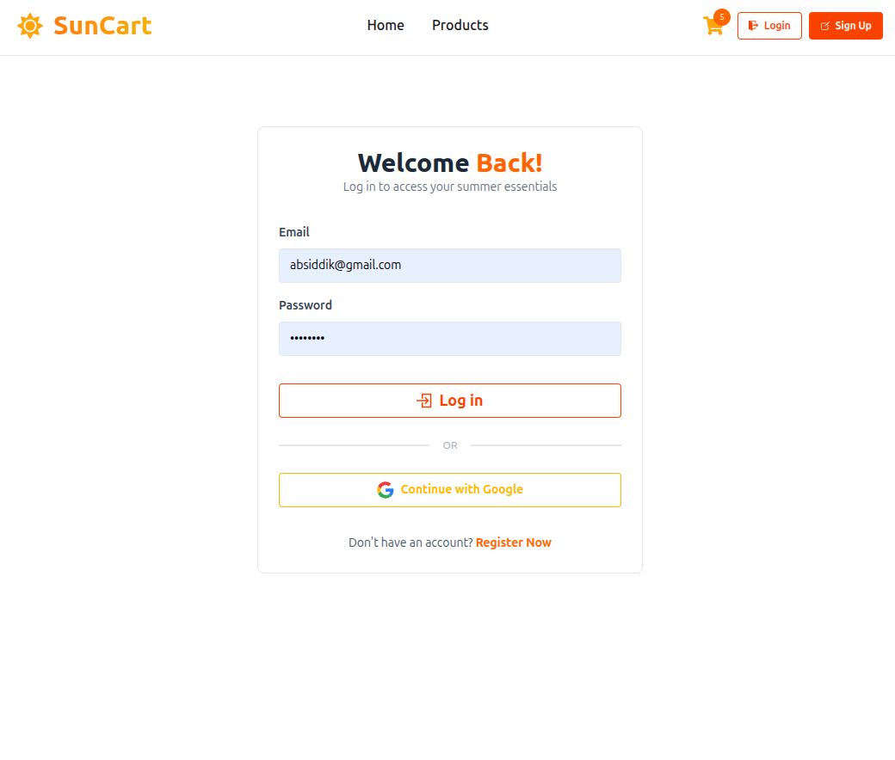
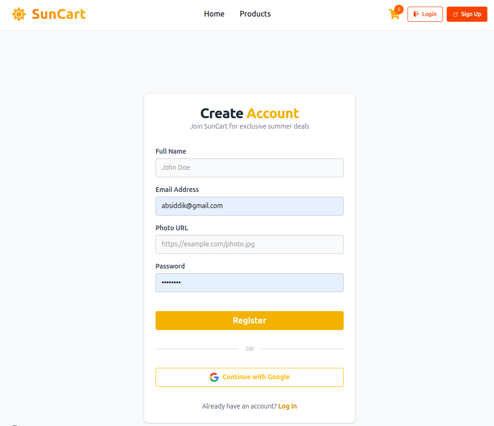
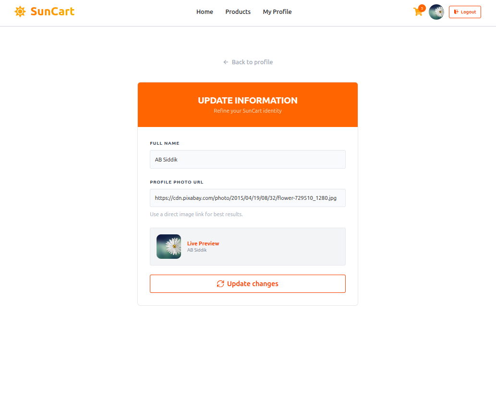

### SunCart - Premium Summer E-commerce Platform


**SunCart** is a modern, full-stack e-commerce application specifically designed for summer essentials, beachwear, and skincare products. Built with a high-end production feel, it focuses on seamless user experience, secure authentication, and sleek animations.

---

## Live Demo
[**Explore SunCart Live**](https://sun-cart-nu.vercel.app)

---

## Project Gallery

|Home Page |  All Products |  Product Details |
| :---: | :---: | :---: |
|  |  |  |

|  Shopping Cart |  Summer Tips & Footer |  User Profile |
| :---: | :---: | :---: |
|  |  |  |

|  Login Page |  Sign Up Page |  Update Profile |
| :---: | :---: | :---: |
|  |  |  |

---

## Project Overview
SunCart provides a specialized shopping experience where users can browse high-quality summer products, view detailed specifications, and manage their shopping cart. The platform features a "Summer Care Tips" section to educate users while they shop.

### Core Features:
*   **Production-Grade Hero Section:** Features an infinite auto-slide carousel with a Ken Burns (slow zoom) effect and smooth text transitions.
*   **Secure Authentication:** Integrated with **BetterAuth** for robust email/password and Google Social Login.
*   **Interactive Shopping Cart:** Real-time cart management with automated price calculations and a "Clear Cart" checkout logic.
*   **Summer Care Guide:** A dedicated UI section for skincare, hydration, and clothing tips.
*   **Brand Marquee:** An infinite scrolling brand logo section (Ray-Ban, Nike, etc.) with hover-pause functionality.
*   **Protected User Profiles:** Secure dashboard for users to view their stats and update personal information.
*   **Modern UI/UX:** Styled with Tailwind CSS and DaisyUI, featuring glassmorphism and premium shadow effects.

---

## Tech Stack

**Frontend:**
*   **Next.js 14** (App Router)
*   **Tailwind CSS** (Utility-first styling)
*   **DaisyUI** (Modern UI component library)
*   **Animate css** (High-fidelity animations)

**Backend & Data:**
*   **Node.js / Express** (Server-side logic)
*   **MongoDB** (NoSQL Database for products and users)
*   **BetterAuth** (Next-generation authentication framework)

---

## Local Installation & Setup

Follow these steps to run SunCart on your local machine:

### 1. Clone the Repository

```bash
git clone https://github.com/ab-siddik-ru-cse/sun-cart.git
cd suncart
npm install
```
### 2. Configure Environment Variables
 - Create a .env.local file in the root directory and add your credentials:
```bash
NEXT_PUBLIC_BETTER_AUTH_URL=http://localhost:3000
DATABASE_URL=your_mongodb_connection_string
GOOGLE_CLIENT_ID=your_google_id
GOOGLE_CLIENT_SECRET=your_google_secret
```
### 3. Run the Development Server
```bash
npm run dev
```
Open http://localhost:3000 in your browser to see the result.

